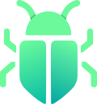

# CatchBug

<!-- Logo -->
<div align="center">


---

> **Zero-Friction In-Browser Diagnostic & Bug Triage Toolkit for QA Testers & Developers.**

[](package.json)
[](https://developer.chrome.com/docs/extensions/mv3/intro/)
[](https://wxt.dev/)
[](https://www.typescriptlang.org/)
[](LICENSE)

</div>

CatchBug eliminates the friction between finding a bug and reporting it. Instead of opening Chrome DevTools, copying messy console errors, capturing screenshots manually, and typing steps to reproduce, CatchBug automatically intercepts runtime diagnostics and user action breadcrumbs—allowing you to create structured bug reports, dispatch GitHub issues, and generate AI root-cause analysis in **a single click**.

---

## ✨ Features

### 1. 🎛️ Isolated Cockpit Dark In-Page Overlay

- **Shadow DOM Isolation**: Injected via WXT `createShadowRootUi` inside an isolated Shadow Root (`#catchbug-overlay-root`). Host page CSS styles will **never** corrupt CatchBug, and CatchBug will **never** leak styles into host applications.
- **Non-Intrusive UX**: Minimizes into a compact floating pill ( `CatchBug (N)`) with error counters and an immediate tactile undo safety window (4s) for cleared logs.
- **Popup as Global Control Center**: Centralized management panel for toggling extension status, configuring domain whitelists, setting data sanitization keywords, and managing external dispatch integrations.

### 2. 🐾 Action Breadcrumbs Trail (Steps to Reproduce)

- **Automatic User Journey Tracking**: Records the last 10 user interactions leading up to a bug:
  - `[CLICK]` Target element selector and readable text content.
  - `[INPUT]` Target form field selector with character count.
  - `[NAVIGATION]` Single Page Application (SPA) routes (`pushState`, `replaceState`, `popstate`, `hashchange`).
- **🛡️ Zero-Credential Leak Guarantee**: Input events strictly record element identifiers and character lengths (e.g. `INPUT[name="password"] (length: 12)`). Keystrokes, passwords, and form values are **never** recorded or stored.

### 3. 📡 Deep Network & Console Telemetry

- **Console Interception**: Captures `console.error` logs directly from the page's `MAIN` execution context.
- **HTTP Failure & Payload Capture**: Automatically intercepts `fetch` and `XMLHttpRequest` calls resulting in HTTP status $\ge 400$ or network failure.
- **Payload Deep Dive**: Captures request bodies (`POST`, `PUT`, `PATCH`) and clones error response bodies (up to 2.5 KB) without breaking the host application's primary response stream.

### 4. 📸 Viewport Screenshot & Rich Annotation Editor

- **Instant Viewport Snap**: Captures the exact visible viewport state (`browser.tabs.captureVisibleTab`) with auto-hiding panels to ensure the bug is never obstructed.
- **Built-in Annotation Canvas**: Draw rectangles, arrows, freehand pens, and color palettes to visually highlight UI flaws.

### 5. 🔒 Client-Side Sensitive Data Masking

- **Built-in Sanitization Engine**: Redacts sensitive information before logs are stored in memory or exported:
  - Authorization Bearer tokens (`Bearer ********`)
  - Common password parameters and credentials (`password=***`)
  - Credit card numbers (Luhn pattern detection)
  - Optional email address masking and user-defined custom keywords.

### 6. ⚡ Zero-Friction Dispatch (GitHub, Slack, Discord & MD)

- **Direct GitHub Issue Creator**:
  - Auto-generates structured bug issue titles based on current routes and primary errors.
  - Embeds telemetry, reproduction breadcrumbs, and screenshots directly into target repositories (`owner/repo`) with custom labels (`bug`, `catch-bug`).
- **Slack & Discord Webhook Broadcast**: Sends formatted Block Kit alerts or Rich Embeds to team triage channels with one click.
- **CSP-Safe Proxy Architecture**: External API requests are routed through the background service worker, avoiding host website `Content-Security-Policy` (`connect-src`) blocks.
- **💾 1-Click Markdown Export**: Download instant `catchbug-report-<date>.md` files or copy structured reports directly to the clipboard.

### 7. 🧠 AI Root Cause Analysis & Reproduction Steps

- **Zero-Cost BYOK (Bring Your Own Key)**: Connect your personal Google Gemini API Key (Free tier from [Google AI Studio](https://aistudio.google.com/)) with zero backend cost.
- **Chrome Built-in AI Ready**: Automatically detects and leverages on-device Gemini Nano via Chrome's Prompt API (`window.ai`).
- **3-Point Triage Insights**:
  1. **Root Cause Synthesis**: Clear explanation of why the failure occurred.
  2. **Steps to Reproduce**: Chronologically organized sequence synthesized from user breadcrumbs.
  3. **Suggested Remediation**: Concrete fix recommendations for frontend and backend engineers.

### 8. 🎯 Target Environment Whitelist

- **Selective Activation**: Limit overlay activation to specific development or staging domains using wildcard patterns (`localhost`, `127.0.0.1`, `*.staging.*`, `*.preview.*`).

---

## 🏗️ Architecture Overview

```
┌───────────────────────────────────────────────────────────────────┐
│                           Target Web Page                         │
│                                                                   │
│  ┌──────────────────────┐              ┌───────────────────────┐  │
│  │     MAIN World       │              │  Isolated Shadow DOM  │  │
│  │ (interceptor.content)│              │  (catchbug-overlay)   │  │
│  │                      │ window.post  │                       │  │
│  │ • fetch / XHR patch  ├─────────────►│ • Cockpit Dark UI     │  │
│  │ • console.error      │   Message    │ • Action Breadcrumbs  │  │
│  │ • click / nav events │              │ • Annotation Canvas   │  │
│  └──────────────────────┘              └───────────┬───────────┘  │
└────────────────────────────────────────────────────┼──────────────┘
                                                     │ browser.runtime
                                                     │ .sendMessage
                                                     ▼
                                         ┌───────────────────────┐
                                         │  Background Service   │
                                         │  Worker (MV3 Proxy)   │
                                         ├───────────────────────┤
                                         │ • captureVisibleTab   │
                                         │ • GitHub REST API     │
                                         │ • Slack/Discord Hook  │
                                         │ • Gemini AI Infer     │
                                         └───────────────────────┘
```

---

## 🚀 Getting Started

### Prerequisites

- **Node.js** v18.0 or higher
- **pnpm** (recommended) or npm

### Installation & Development

1. **Clone the repository**:

   ```bash
   git clone https://github.com/bikinan/catch-bug.git
   cd catch-bug
   ```

2. **Install dependencies**:

   ```bash
   pnpm install
   ```

3. **Start local development mode**:

   ```bash
   pnpm dev
   ```

   _This starts the WXT development server with hot module replacement (HMR)._

4. **Load into Google Chrome**:
   - Open Chrome and navigate to `chrome://extensions/`.
   - Enable **Developer mode** in the top right corner.
   - Click **Load unpacked** and select the `.output/chrome-mv3` folder inside the project directory.

5. **Production Build**:
   ```bash
   pnpm build
   ```
   _The distributable package will be created in `.output/chrome-mv3/`._

---

## 🛠️ Tech Stack

- **Extension Framework:** [WXT](https://wxt.dev/) (Next-gen Web Extension Framework)
- **UI Layer:** [Vue 3](https://vuejs.org/) (Composition API, `<script setup>`)
- **Styling:** Vanilla CSS (Custom Cockpit Dark Design System)
- **Language:** [TypeScript](https://www.typescriptlang.org/) (Strict Mode)
- **AI Engine:** Google Gemini API (`gemini-2.5-flash`) & Chrome Built-in Prompt API
- **Target Environment:** Google Chrome & Chromium-based browsers (Manifest V3)

---

## 🔒 Security & Privacy Policy

- **Zero-Telemetry Tracking**: CatchBug does not collect or transmit tracking analytics to any central server.
- **Local-Only Storage**: All captured logs, screenshots, tokens, and preferences are stored exclusively on your local machine via `browser.storage.local`.
- **Zero Credential Leaks**: Form input values, passwords, and sensitive headers are redacted before storage.

---

## 🤝 Community & Contributing

We welcome contributions from developers, QA engineers, and open-source enthusiasts!

- **[Contributing Guide](CONTRIBUTING.md)**: Setup, architectural guardrails, branching, and PR workflow.
- **[Security Policy](SECURITY.md)**: Vulnerability disclosure guidelines and privacy architecture.
- **[Code of Conduct](CODE_OF_CONDUCT.md)**: Our pledge to maintain a welcoming community.

---

## 📄 License

This project is licensed under the **MIT License** — see the [LICENSE](LICENSE) file for details.
